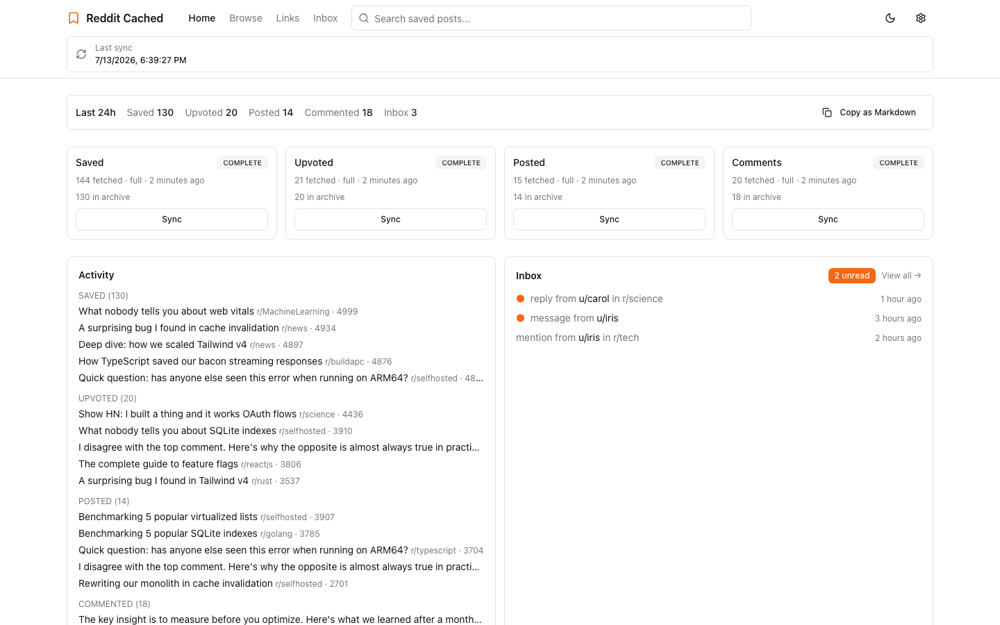
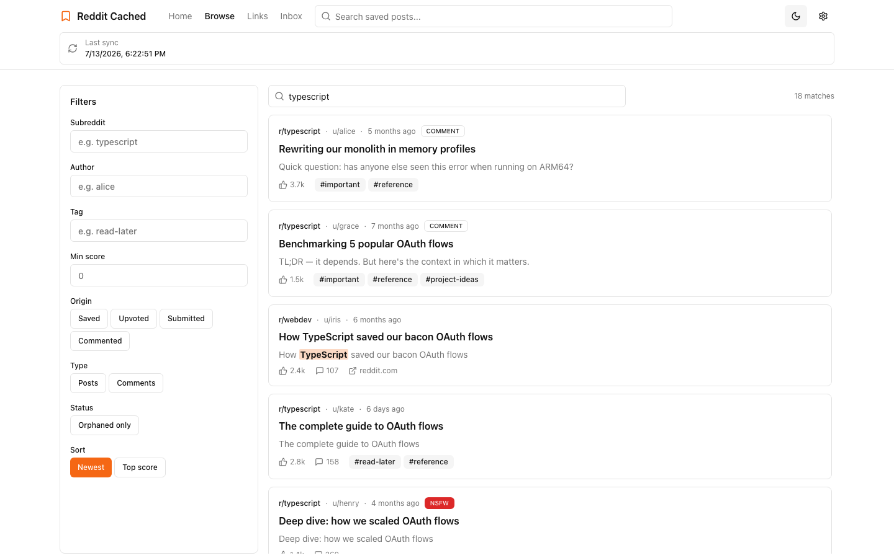
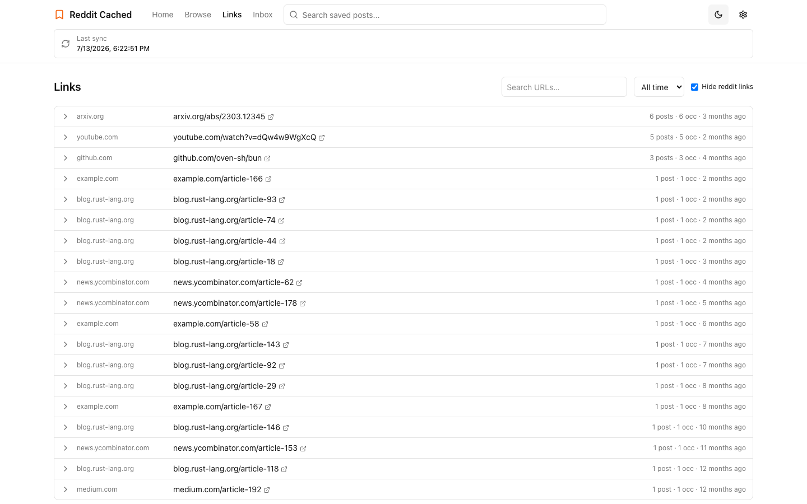
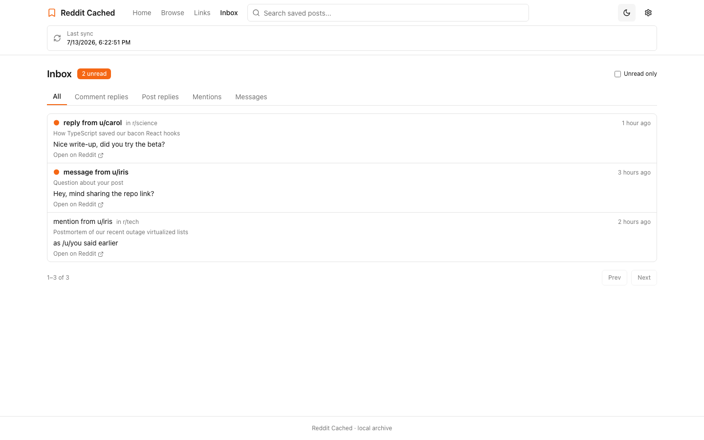
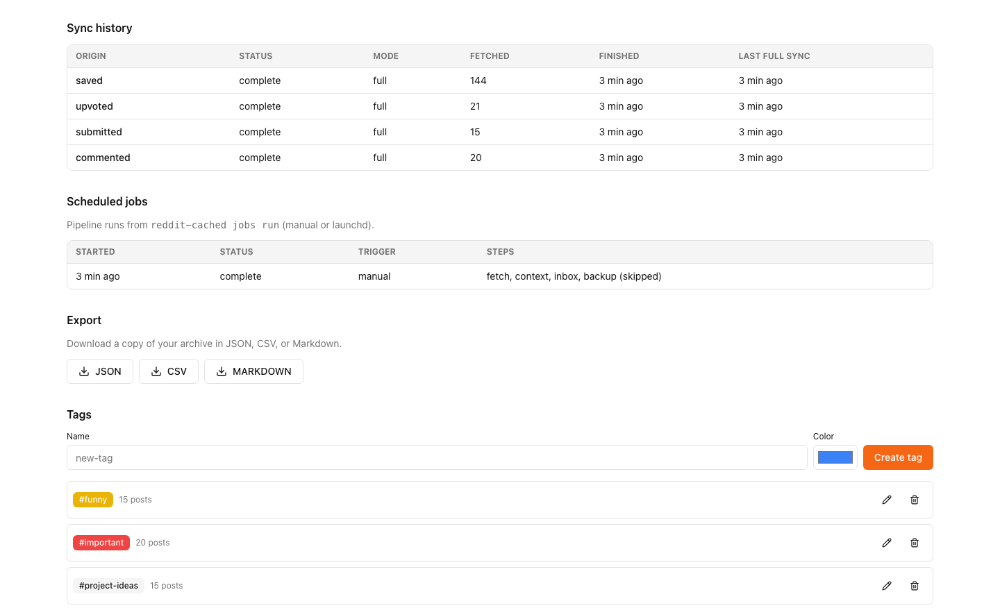

# Reddit Cached

A local-first archive of your Reddit life. Reddit Cached pulls your saved,
upvoted, submitted, and commented content — plus your inbox — into a SQLite
database on your machine, then gives you a fast web dashboard and a JSON-first
CLI on top of it. Search a decade of saves in milliseconds, keep content Reddit
has deleted, escape the ~1000-item listing cap, and let your agents query the
same archive you browse.

<picture>
  <source media="(prefers-color-scheme: dark)" srcset="docs/screenshots/dashboard-dark.png">
  
</picture>

## Features

**Full-text search over everything you ever saved.** FTS5 across titles,
selftext, comment bodies, subreddits, authors, flair, and URLs — with filters
for subreddit, author, tag, score, date range, origin, and content type. Local
tags stay local.



**An outbound link index.** Every URL mentioned in your archive, normalized and
deduplicated. Answer "what was that link someone posted about X?" without
remembering where you saw it.



**Your inbox, cached and readable offline.** Comment replies, post replies,
mentions, and private messages sync into the archive; unread state mirrors
Reddit as of the last sync, and nothing is ever marked read on Reddit.



**Sync provenance you can audit.** Every fetch records a sync run per origin;
the pipeline records job runs. The dashboard and settings page show exactly
what synced, when, and whether orphan detection saturated.



Plus: deterministic `research` briefs and `today` digests rendered entirely
from local data (no AI, no network), orphan detection for content removed from
Reddit, media previews, exports to JSON/CSV/Markdown, and selective bulk
unsave.

## Install & setup

The `reddit-cached` binary bundles the CLI and the web dashboard. Pick a
channel:

```bash
# One-liner (macOS/Linux, installs to ~/.local/bin)
curl -fsSL https://raw.githubusercontent.com/aurokin/reddit_cached/main/install.sh | bash

# Homebrew
brew install aurokin/tap/reddit-cached

# Try it without installing, if you have Bun (https://bun.sh)
bunx reddit-cached --help
```

Note that `bunx` runs from Bun's cache without putting `reddit-cached` on your
PATH — prefix the commands below with `bunx` (or `bun install -g reddit-cached`
for a real command), and set up [scheduled syncs](#scheduled-syncs) from a
brew/install.sh/tarball binary so the schedule doesn't point into an evictable
cache.

Or download a platform tarball from the
[releases page](https://github.com/aurokin/reddit_cached/releases) and verify
it against `SHA256SUMS`. To run from a source checkout instead, see
[Development](#development).

Start the dashboard:

```bash
reddit-cached serve
```

Open `http://127.0.0.1:3001`, then connect your Reddit session:

1. Install the companion browser extension — download
   `reddit-cached-extension.zip` from the release page, unzip it, and "Load
   unpacked" in Chrome (or load `packages/extension` from a checkout; for
   Firefox and details see
   [packages/extension/README.md](./packages/extension/README.md)). It
   forwards your reddit.com session cookies to the local app. This is the
   primary auth mode; OAuth (`reddit-cached auth login`) is a legacy fallback
   for users with a registered Reddit app.
2. Once the app shows you as connected, run a sync from the UI — or from the
   CLI. The extension session is enough for CLI fetches too:

```bash
reddit-cached fetch --all        # saved, upvoted, submitted, comments
reddit-cached fetch context      # capture thread context around saves
reddit-cached fetch inbox        # replies, mentions, messages
```

The database lives in the platform data directory — macOS:
`~/Library/Application Support/reddit-cached/reddit-cached.db`, Linux (XDG):
`~/.local/share/reddit-cached/reddit-cached.db`. Both the web app and the CLI
honor `REDDIT_CACHED_DB=<path>`, and the CLI's `--db <path>` flag overrides it.
By default the web UI and CLI share the same database and auth files.

## Scheduled syncs

`reddit-cached jobs run` executes the full pipeline (fetch all origins →
capture context → sync inbox → backup). Install it on a timer with one command:

```bash
# macOS: launchd agent, hourly by default
reddit-cached jobs install-launchd --interval-seconds 3600

# Linux: systemd user units, hourly by default
reddit-cached jobs install-systemd --interval-seconds 3600
```

Check recent runs with `reddit-cached jobs status`, and remove the schedule
with `jobs uninstall-launchd` / `jobs uninstall-systemd`. Overlapping runs are
lock-protected and exit cleanly instead of racing.

## Import your Reddit GDPR export

Reddit's API only exposes the newest ~1000 items per listing. To backfill
beyond that, request your data export at
[reddit.com/settings/data-request](https://www.reddit.com/settings/data-request),
unzip it, and run:

```bash
reddit-cached import path/to/export --dry-run   # parse and count, no writes
reddit-cached import path/to/export
```

It reads the export CSVs (saved posts/comments, upvotes, your posts and
comments), skips items already archived, hydrates the rest from Reddit, and
stores content Reddit no longer serves as `[deleted]` stubs.

## Git backup

Back the archive up as deterministic JSONL in a git repository — byte-identical
output for the same database state, so an unchanged sync produces no commit:

```bash
reddit-cached backup init --repo ~/backups/reddit
reddit-cached backup sync
reddit-cached backup status
```

Once configured, the scheduled pipeline runs the backup step automatically.
Backups are local commits by default; to also push, the repo needs a git
remote — pass `--remote origin --push` to `backup init` and syncs will push
after each commit.

## For agents

The CLI outputs JSON by default (pass `-H`/`--human` for tables), so every
command is directly pipeable:

```bash
reddit-cached search "cache invalidation" | jq -r '.[].title'
reddit-cached status | jq '.totalPosts, .lastSyncTime'
reddit-cached links top --window 90d --exclude-reddit | jq -r '.[].canonical_url'
reddit-cached research "rust async" --out brief.md   # deterministic markdown brief
reddit-cached today --window 7d                      # what's new digest
```

There is an agent skill at
[skills/reddit-cached/SKILL.md](./skills/reddit-cached/SKILL.md)
that teaches agents when to reach for `search` vs `research` vs `links` vs
`today`, and a drift guard test keeps it in sync with the real command surface.
Install it with the Skills CLI:

```bash
npx skills add aurokin/reddit_cached --global --skill reddit-cached --agent codex claude-code --full-depth
```

The authoritative command reference is
[docs/interfaces/cli.md](./docs/interfaces/cli.md).

## Development

Requires [Bun](https://bun.sh). From a source checkout you can run the CLI
directly (`cd packages/cli && bun run src/index.ts`) or compile the standalone
binary:

```bash
git clone https://github.com/aurokin/reddit_cached && cd reddit_cached
bun install
bun run build:binary   # emits packages/cli/dist/reddit-cached (CLI + web dashboard)
```

To run the whole stack against deterministic fixture data — no Reddit account
needed — see the seeded `TEST_MODE` harness in
[packages/web/README.md](./packages/web/README.md). The workspace verification
routine (`bun run verify`) is documented in
[docs/harness/workspace.md](./docs/harness/workspace.md).

## Docs

- [docs/README.md](./docs/README.md) — docs hub and reader paths
- [docs/architecture.md](./docs/architecture.md) — packages, invariants, constraints
- [docs/interfaces/cli.md](./docs/interfaces/cli.md) — CLI reference
- [docs/interfaces/web-api.md](./docs/interfaces/web-api.md) — local web API
- [packages/web/README.md](./packages/web/README.md) — web app deep dive
- [packages/extension/README.md](./packages/extension/README.md) — companion extension
